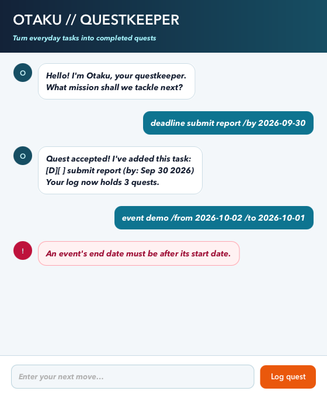

# Otaku User Guide

Otaku is a task-tracking chatbot that manages todos, deadlines, and events through text commands.



## Sorting tasks chronologically

Use `sort` to place dated tasks in chronological order. Deadlines use their due date, events use their start date,
and todos without dates appear last. Tasks with the same date retain their existing order.

Example: `sort`

```text
Here are the tasks in your list:
1.[E][ ] orientation (from: Jan 02 2026 to: Jan 03 2026)
2.[D][ ] submit report (by: Sep 30 2026)
3.[T][ ] buy stationery
```

The command does not accept arguments. For example, `sort date` produces an error and leaves the task order
unchanged.
